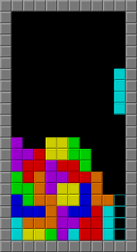

# Tetris AI

A heuristic tetris player, fined-tuned using genetic algorithms.

## Automating Tetris

Tetris is a simple game which can be played in an automated fashion using *heuristics*. A heuristic estimates the value or utility of a particular state which can be reached by taking some action. Heuristics can either be used immediately or applied to a number of *possible* future states which may be reached after several actions. The latter aproach then typically applies minimax, [expectiminimax](https://en.wikipedia.org/wiki/expectiminimax) (or otherwise, more complex environment modelling), to choose an action with the highest expected payoff. In this implementation however, we only use a lookahead of 1.

### Fine-tuning

In order to find a useful heuristic for the given environment, we employ genetic algorithms to optimize the weights given to various environment features (e.g. the height of each row). The magnitude of each feature weight corresponds to how important the feature is when measuring the overall utility of a state.

## Future

* Increase look-ahead to improve utility estimates.

## Resources

* Mark Handley's original Tetris engine: https://github.com/mhandley/ENGF2-2022/tree/master/assignments/assignment4/tmp.
